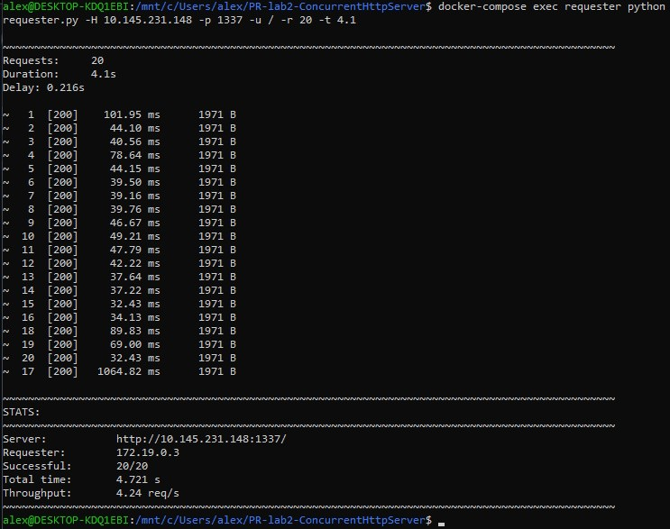

# Concurrent HTTP Server =(^.^)=

## Introduction

Hello World! =(^.^)=  
This lab builds upon **Lab 1’s HTTP Server**, extending it with **concurrency** and **thread-safety**.  
The goal was to make the server handle multiple connections **concurrently** instead of sequentially — allowing multiple clients to interact with the server at the same time.  

Two main concepts guided this lab:
- **Concurrency** (high-level / PLT definition): structuring a program as *independent parts* that can be executed without assuming sequential ordering.
- **Parallelism** (hardware-level): executing computations *simultaneously* on multiple processors.

According to the **PLT view**, concurrency and parallelism are **orthogonal** — concurrency is a *design property* of the program, while parallelism is a *runtime property* of the hardware.  
Therefore, a concurrent program may or may not run in parallel, and a parallel computation may or may not be concurrent in structure.

---

## Project Structure

Same structure as Lab 1, with two additional scripts for testing concurrency and rate limiting:

```
PR-lab2-ConcurrentHttpServer/
├── server.py             # Multithreaded HTTP server
├── requester.py          # Script that makes concurrent requests for testing
├── Dockerfile.server     # Docker image for the concurrent server
├── Dockerfile.requester  # Docker image for the requester
├── docker-compose.yml    # Orchestrates server and requester containers
├── content/              # Files to be served (HTML, PNG, PDF, etc.)
│   ├── ...
│   └── downloads/        # Directory for requester downloads
└──────
```

---

## Running the Server

### Syntax

```bash
# Docker execution (using docker-compose)
docker-compose up -d

# Local execution
python server.py -d [SERVE_DIRECTORY]
```

- `-d [SERVE_DIRECTORY]`: Directory to serve files from (defaults to current directory).  
- The server listens on port **1337**.  
- Access the server via [http://localhost:1337](http://localhost:1337).  
- To stop the server, use `docker-compose down`.

---

## Client (Requester) Usage

```bash
# Ensure docker-compose is running
docker-compose up -d

# Run requester
docker-compose exec requester python requester.py -H server -p 1337 -u ./ -r 20 -t 4.1
```

Where:
- `-H` = host  
- `-p` = port  
- `-u` = URL  
- `-r` = number of requests  
- `-t` = artificial delay (simulates processing time per request)

---

## Experiment 1 — Listening Queue Depth

### Server listen(1)

The server’s backlog (listen queue) was set to `1`, meaning only one pending connection could wait while another was being handled.


As expected, most requests were queued or dropped since only one could be accepted at a time.

---

### Server listen(10)

By increasing the backlog to `10`, multiple connections were queued and processed sequentially without immediate rejections.


However, requests still executed **one after another** — no true concurrency yet.

---

## Experiment 2 — Thread per Request

After implementing a **thread-per-request** model, the server spawned a new thread for every client connection.

```python
# simplified example
client_thread = threading.Thread(target=handle_client, args=(conn, addr))
client_thread.start()
```

Now, multiple connections could be served **concurrently**, significantly reducing total handling time.


Each request handler simulated a 1-second workload.  
With 10 concurrent requests, total handling time dropped from ~10s (sequential) to just above ~1s (concurrent).

---

## Experiment 3 — Counter Feature (Naive)

A global counter was introduced to count how many times each file was requested.  
Initially, it was implemented **without synchronization**, like this:

```python
file_hits[path] = file_hits.get(path, 0) + 1
```

### Results

Due to **race conditions**, the hit counts became inconsistent — different threads overwrote each other’s increments.


---

## Experiment 4 — Counter Feature (Thread-Safe)

To fix the race condition, a **threading.Lock** was used around the counter update:

```python
with counter_lock:
    file_hits[path] = file_hits.get(path, 0) + 1
```

### Results

Even when increasing simulated processing time to 0.1 seconds, all increments were handled correctly and deterministically.


---

## Experiment 5 — Requests over the Network

### Requests via Docker Network

The requester (client) container sent concurrent requests to the server container running on another machine via Docker network bridge.



---

## Rate Limiting (5 req/sec per IP)

A **rate limiter** was implemented using a dictionary mapping each client IP to its recent request timestamps.  
When the number of requests within the past second exceeded the limit, the server responded with **HTTP 429 Too Many Requests**.

```python
if len(requests[ip]) > 5:
    send_429_response()
```

---

## Conclusions

- **Concurrency (PLT definition)** was achieved — the server was restructured into independent parts that could handle requests without sequential dependency.
- **Race conditions** were observed and fixed using synchronization primitives.
- **Rate limiting** improved robustness against flooding.
- Overall, the concurrent version handled everything way better than before :'3

---

<div style="display: flex; justify-content: center;">
<pre style="background: none;">
      |\      _,,,---,,_
ZZZzz /,`.-'`'    -.  ;-;;,_
     |,4-  ) )-,_. ,\ (  `'-'
    '---''(_/--'  `-'\_)</pre>
</div>
