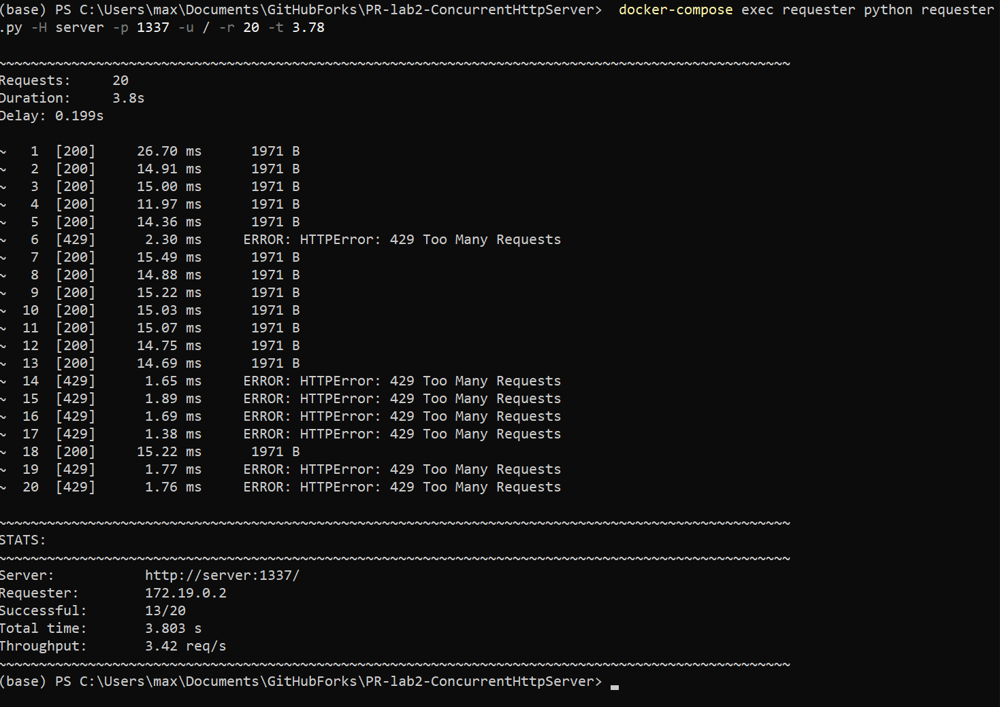
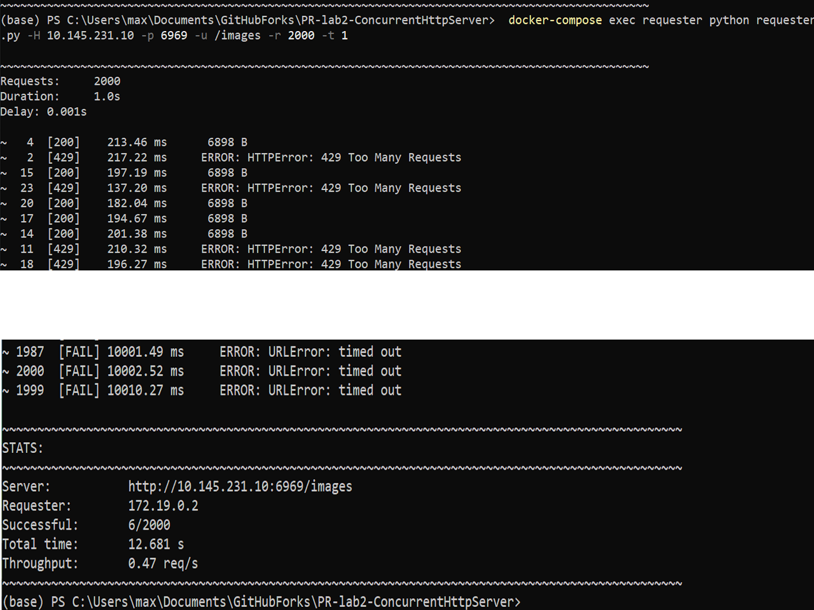

# Concurrent HTTP Server =(^.^)=

## Overview

This lab builds upon **Lab 1’s HTTP Server**, extending it with **concurrency** and **thread-safety**.  

The goal was to make the server handle multiple connections **concurrently** instead of sequentially.  

Two main concepts guided this lab:
- **Concurrency** (high-level / PLT definition): structuring a program as *independent parts* that can be executed without assuming sequential ordering.
- **Parallelism** (hardware-level): executing computations *simultaneously* on multiple processors.

According to the **PLT view**, concurrency and parallelism are **orthogonal** — concurrency is a *design property* of the program, while parallelism is a *runtime property* of the hardware.  
Therefore, a concurrent program may or may not run in parallel, and a parallel computation may or may not be concurrent in structure.

---

## Project Structure

Around same structure as Lab 1, with the client being replaced by scripts for testing concurrency and rate limiting:

```
PR-lab2-ConcurrentHttpServer/
├── server.py             # Concurrent HTTP server
├── requester.py          # Script that makes concurrent requests for testing
├── Dockerfile.server     # Docker image for the concurrent server
├── Dockerfile.requester  # Docker image for the requester
├── docker-compose.yml    # Orchestrates server and requester containers
├── content/              # Files to be served (HTML, PNG, PDF, etc.)
│   ├── ...
│   └── downloads/        # Directory for requester downloads
└──────
```

---

## Running the Server

### Syntax

```bash
# Docker execution (using docker-compose)
docker-compose up -d

# Local execution
python server.py -d [SERVE_DIRECTORY]
```

- `-d [SERVE_DIRECTORY]`: Directory to serve files from (defaults to current directory).  
- The server listens on port **1337**.  
- Access the server via [http://localhost:1337](http://localhost:1337).  
- To stop the server, use `docker-compose down`.

---

## Requester Usage

```bash
# Ensure docker-compose is running
docker-compose up -d

# Run requester
docker-compose exec requester python requester.py -H server -p 1337 -u ./ -r 20 -t 4.1
```

Where:
- `-H` = host  
- `-p` = port  
- `-u` = URL  
- `-r` = number of requests  
- `-t` = duration / time based on which we spread the requests evenly

---

## Request server from lab1
### Server listen(1)

The server’s backlog (listen queue) was set to `1`, meaning only one pending connection could wait while another was being handled.


As expected, most requests were queued or dropped since only one could be accepted at a time.

---

### Server listen(10)

By increasing the backlog to `10`, multiple connections were queued and processed sequentially without immediate rejections.


However, requests still executed **one after another** — no true concurrency yet. Therefore the `Overall` throughput is quite low.

---

## Request new concurrent server

After implementing a **thread-per-request** model, the server spawned a new thread for every client connection.

Now, multiple connections could be served **concurrently**, significantly improving the throughput.


---

## Counter Feature (Naive)

Counter was introduced to count how many times each file/folder was requested.  
Initially, it was implemented **without synchronization**, like this:


Due to **race conditions**, the hit counts became inconsistent — different threads overwrote each other’s increments.

---

## Counter Feature (Thread-Safe)

To fix the race condition, a **threading.Lock** was used around the counter update:


Even when increasing simulated processing time to 0.1 seconds, all increments were handled correctly and deterministically.

---

## Requests over the Network via Docker

The requester (client) container sent concurrent requests to the server container running on another machine via Docker network bridge.


By staying within the sliding window of the rate limiter no 429 reponses were received.

---

## Rate Limiting (5 req/sec per IP)

A sliding window rate limiter was implemented using a dictionary that maps each client IP to its recent request timestamps.

The system continuously maintains a one-second sliding window — discarding timestamps older than one second — to ensure a fair and accurate limit.




If the number of requests within the current window exceeds the threshold, the server responds with HTTP 429 Too Many Requests.

---

## Trying to DDoS my friend

In continuity, I also tried to spam my friend's (Adrian Vremere) server using my requester by sending 2000 requests to him.





All that's to be said is that his http webserver was still usable, as the rate-limiter only flagged my requester rather than any other request with a different IP, such as the one given to my phone.

---

## Conclusions

- **Concurrency** was achieved — the server was restructured into independent parts that could handle requests without sequential dependency.
- **Race conditions** were observed and fixed using synchronization primitives.
- **Rate limiting** - improved robustness against potential DDoS attacks.
- About programs: **Concurrency is a property; Parallelism is a behavior**.

---

<div style="display: flex; justify-content: center;">
<pre style="background: none;">
      |\      _,,,---,,_
ZZZzz /,`.-'`'    -.  ;-;;,_
     |,4-  ) )-,_. ,\ (  `'-'
    '---''(_/--'  `-'\_)</pre>
</div>
